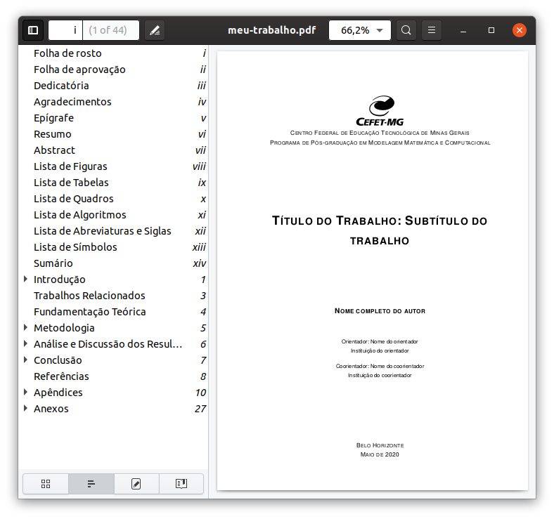

# LaTeX CEFET-MG [](https://github.com/cfgnunes/latex-cefetmg/actions)

Modelo não-oficial de trabalho acadêmico desenvolvido para os alunos do [CEFET-MG](http://www.cefetmg.br/).
Este projeto consiste em uma estrutura básica de arquivos em [LaTeX](https://www.latex-project.org/) para o desenvolvimento de trabalhos monográficos (TCC, Dissertação e Tese).
Inspirado no projeto [abnTeX2](https://github.com/abntex/abntex2), o modelo é compatível com as normas [ABNT](http://www.abnt.org.br/) vigentes.

É possível utilizar esse modelo online ou instalando o LaTeX em seu computador.

[](https://www.overleaf.com/latex/templates/latex-cefetmg/vtpykndsqtkf)

## Usando o modelo online

Vantagens de usar o modelo online são:

- não precisa instalar o LaTeX;
- permite editar seu trabalho em diferentes computadores;
- permite compartilhar o texto online com outras pessoas de forma simples.

Desvantagem:

- só poderá editar seu trabalho se estiver conectado na Internet.

Para utilizar o LaTeX online é necessário que você se registre gratuitamente no [Overleaf](https://www.overleaf.com/latex/templates/latex-cefetmg/hsyqwvtprcpt).
Note que existe uma versão paga do Overleaf, que oferece funcionalidades que podem ser desejáveis, mas não são necessárias.

Para abrir este modelo diretamente no Overleaf, [clique aqui](https://www.overleaf.com/latex/templates/latex-cefetmg/vtpykndsqtkf).

## Usando o modelo em seu computador (usando GNU/Linux)

### Pré-requisitos

Esta seção assume o sistema operacional Ubuntu 16.04 (também testado no Ubuntu 20.04), mas o procedimento é semelhante para outras distribuições GNU/Linux.
Para poder compilar o documento, basta instalar os seguintes pacotes no terminal:

```sh
sudo apt -y install \
    make \
    latexmk \
    texlive \
    texlive-lang-portuguese \
    texlive-latex-extra \
    texlive-publishers \
    texlive-science \
    texlive-xetex \
    texlive-fonts-extra
```

### Compilar documento

Para compilar o projeto e gerar o documento no formato PDF, execute o seguinte comando no terminal:

```sh
make
```

## Contribuindo

Se você encontrar um problema ou quiser melhorar o código, ou até mesmo melhorar o conteúdo, você pode:

- [Abrir um problema](https://github.com/cfgnunes/latex-cefetmg/issues/new) descrevendo o erro ou a ideia de uma funcionalidade nova;
- Criar um fork do projeto, realizar mudanças, e submeter um pull request.

## Autores

- Cristiano Nunes - _Desenvolvedor_
- Cristina Murta - _Sugestões e revisão_
- Henrique Borges - _Sugestões e revisão_

## Agradecimentos

- Denise Souza
- Guilherme Tonioli
- Izaquiel Bessas
- Lauro César
- Talles Coelho
